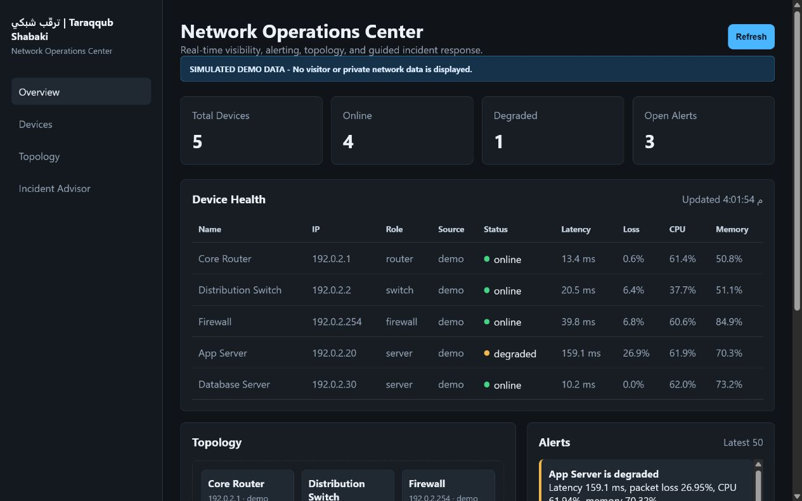
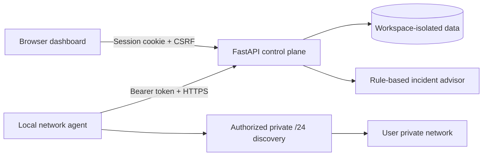
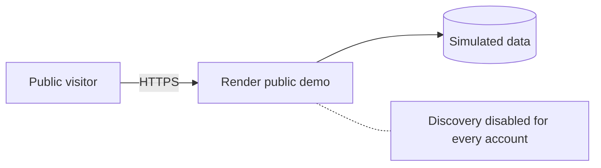

# ترقّب شبكي | Taraqqub Shabaki

[](https://github.com/Belal-Alqarni/Taraqqub-Shabaki/actions/workflows/ci.yml)
[](https://github.com/Belal-Alqarni/Taraqqub-Shabaki/releases)
[](LICENSE)

[Try the live public demo](https://taraqqub-shabaki-demo.onrender.com) - viewer-only
simulated data; the free instance can take up to a minute to wake up.

Secure network monitoring, discovery, alerting, topology visualization, and
guided incident response in one self-hosted Network Operations Center.

## الفكرة

**ترقّب شبكي** منصة تعليمية وعملية لمراقبة البنية التحتية للشبكات من لوحة
تحكم واحدة. تجمع حالة الأجهزة وزمن الاستجابة وفقدان الحزم واستهلاك الموارد،
وتكتشف الأجهزة المصرح بفحصها، وتعرض خريطة الشبكة والتنبيهات، ثم تقدم إرشادات
منظمة لتشخيص الأعطال.

المشروع ليس برنامج Ping فقط. الهدف هو بناء Control Plane قريب في فكرته من
أدوات NOC الاحترافية، مع فصل آمن بين المنصة السحابية وAgent يعمل داخل
شبكة كل مستخدم.



## Current Capabilities

| Area | What works now |
| --- | --- |
| Monitoring | Device status, latency, packet loss, CPU, memory, and traffic metrics |
| Discovery | Authorized Nmap discovery restricted to private IPv4 networks up to `/24` |
| Topology | Automatic visual map generated from the known devices |
| Alerts | Open and acknowledged incident timeline |
| Incident Advisor | Rule-based likely causes and recommended remediation steps |
| Access control | Isolated workspaces with `viewer`, `operator`, and `admin` roles |
| Network Agent | Revocable token, private `/24` discovery, and outbound HTTPS reports |
| Public demo | Viewer-only simulated environment with all network scanning disabled |
| Deployment | Hardened Docker image, Docker Compose, health check, and Render Blueprint |

The Incident Advisor is intentionally described as **rule-based**. A real LLM
integration is a future milestone, not a feature claimed by the current release.

## Release Model

Version `1.0.0` is a complete self-hosted release. Operators run the control
plane with Docker and connect one or more outbound-only network agents. The
hosted Render URL is intentionally a portfolio-safe demo, not a managed
production SaaS offering.

## User Roles

| Role | Access |
| --- | --- |
| Viewer | Read dashboards, devices, topology, alerts, and advisor results |
| Operator | Viewer access plus operational alert actions |
| Admin | User provisioning, authorized discovery, and administrative actions |

Public sign-up is controlled by `TARAQQUB_ALLOW_SIGNUP`. Each signup creates an
isolated workspace and an administrator account. Team accounts created by that
administrator remain inside the same workspace.

For an internet-facing installation, use persistent storage before enabling
signup. The included free Render demo keeps signup disabled because its local
SQLite filesystem is ephemeral.

## Architecture



The public portfolio deployment uses simulated devices only. It does not have a
route into the owner's private network:



The control plane never initiates a connection into a user's LAN. The local
agent discovers only an explicitly configured private IPv4 subnet and sends
approved telemetry outbound over HTTPS.

## Security Controls

- Salted PBKDF2 password hashes and server-side session storage.
- `HttpOnly` and `SameSite=Strict` session cookies; `Secure` cookies in production.
- CSRF tokens on state-changing authenticated requests.
- Login and public-demo rate limiting.
- Signup and agent-report rate limiting.
- Workspace filtering on devices, metrics, alerts, users, and agents.
- Agent tokens stored only as SHA-256 hashes and revocable at any time.
- Agent reports restricted to private IPv4 addresses and 256 devices per report.
- Role checks on administrative and operational endpoints.
- Mandatory password change for newly provisioned users.
- Session revocation after password changes.
- Content Security Policy, clickjacking protection, MIME sniffing protection,
  restrictive permissions policy, and no-store API responses.
- Private-network allow-list validation before discovery.
- Discovery completely disabled in public-demo mode, including for administrators.
- Non-root Docker user, read-only root filesystem, all Linux capabilities
  dropped, and `no-new-privileges`.
- Secrets, databases, runtime data, and local environment files excluded from Git.

No application can be guaranteed perfectly secure. This project applies
defense-in-depth controls and keeps active scanning out of the public demo.

## Run With Docker

Create a local `.env` file:

```env
TARAQQUB_ADMIN_PASSWORD=replace-with-a-long-random-password
TARAQQUB_SECURE_COOKIES=false
TARAQQUB_ALLOW_SIGNUP=false
TARAQQUB_SCAN_NETWORK=192.168.1.0/24
TARAQQUB_SCAN_GATEWAY=192.168.1.1
```

Only configure a network you own or are explicitly authorized to test.

```powershell
docker compose up --build
```

Open `http://127.0.0.1:8000` and sign in with username `admin` and the password
from `TARAQQUB_ADMIN_PASSWORD`. Compose binds the service to localhost only.

## Run Without Docker

```powershell
python -m venv .venv
.\.venv\Scripts\Activate.ps1
pip install -r requirements.txt
$env:TARAQQUB_ADMIN_PASSWORD = "replace-with-a-long-random-password"
uvicorn app.main:app --reload
```

The development fallback password is for localhost development only. Production
mode refuses to start with that password or with a password shorter than 12
characters.

## Connect A Network Agent

1. Sign in as a workspace administrator.
2. Open **Network Agents** and create a token. The token is shown once.
3. Clone this repository on a machine inside the authorized network.
4. Build and run the agent:

```powershell
docker build -f Dockerfile.agent -t taraqqub-agent .
docker run --rm --read-only --cap-drop ALL `
  --security-opt no-new-privileges `
  -e TARAQQUB_SERVER_URL=https://your-taraqqub-server.example `
  -e TARAQQUB_AGENT_TOKEN=the-one-time-token `
  -e TARAQQUB_AGENT_NETWORK=192.168.1.0/24 `
  -e TARAQQUB_AGENT_INTERVAL=60 `
  taraqqub-agent
```

The subnet must be private IPv4 and no larger than `/24`. Use only a network
you own or are explicitly authorized to monitor. Revoke a lost agent token from
the dashboard immediately.

## Public Demo

The included `render.yaml` creates a portfolio-safe deployment:

- HTTPS and secure cookies.
- A generated administrator secret.
- A public **Try public demo** button.
- Viewer-only demo sessions.
- Simulated infrastructure data.
- Discovery disabled for every account.
- Health checks through `/api/health`.

Connect the repository to a Render Blueprint to receive an HTTPS
`onrender.com` URL. Add a custom domain later if needed.

## Repository Layout

```text
app/
  agents.py        Agent tokens, authentication, rate limits, and ingestion
  main.py          FastAPI routes and security middleware
  auth.py          Authentication, sessions, roles, CSRF, and audit events
  collectors.py    Monitoring collectors
  discovery.py     Private-network validation and Nmap discovery
  advisor.py       Rule-based incident analysis
  database.py      SQLite schema and connection handling
  services.py      Devices, metrics, alerts, and topology services
  static/          Dashboard and authentication UI
agent/
  taraqqub_agent.py  Outbound-only local network collector
Dockerfile         Hardened application image
Dockerfile.agent   Hardened local agent image
docker-compose.yml Local private deployment
render.yaml        Safe public-demo deployment
CHANGELOG.md       Version history
LICENSE            MIT open-source license
```

## Roadmap

1. Add PostgreSQL production storage and schema migrations.
2. Add SNMP collectors and encrypted credential storage.
3. Add email, Telegram, Slack, and Discord notification channels.
4. Add Packet Tracer and GNS3 lab profiles.
5. Add approval-controlled self-healing runbooks.
6. Add an optional real LLM integration for incident summaries.
7. Add automated tests, historical charts, reports, and export workflows.

## Responsible Use

Use discovery and remediation features only on infrastructure you own or have
explicit written authorization to test. Do not expose the local scanning service
directly to the internet.
